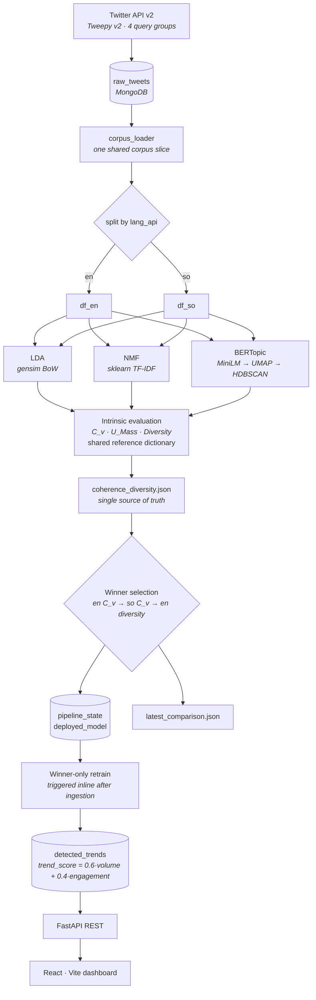

<div align="center">

# Real-Time Trending Topic Detection

**Bilingual (English · Somali) trending topic detection from Twitter/X, where three unsupervised topic models compete and the measured winner is deployed.**

[](https://www.python.org/)
[](https://fastapi.tiangolo.com/)
[](https://react.dev/)
[](https://www.mongodb.com/)
[](#testing)
[](#license)

Final Year Project · 2026

</div>

---

## Overview

Most trending-topic systems assume a single model and a single language. This one does neither.

It ingests public tweets, trains **LDA**, **NMF**, and **BERTopic** on the *same* corpus, scores all three against *identical* intrinsic metrics in **English and Somali separately**, and promotes the highest-scoring model to production. The two losers are frozen — the winner alone retrains as new data arrives.

The result is a system whose model choice is an empirical outcome rather than an assumption, and whose Somali topics are scored against a Somali reference corpus rather than being folded into an English-dominated average.

### What makes it different

| | |
|---|---|
| **Competitive model selection** | Three algorithms, one corpus, one metric suite. The winner is measured, not chosen. |
| **Per-language modeling** | English and Somali are trained and scored as separate slices, never averaged into a single misleading number. |
| **Winner-only deployment** | After selection, only the winning model retrains. Compute goes where it counts. |
| **Reproducible evaluation** | Same corpus, same reference dictionary, same tokenizer, seed 42 across all three models. |
| **Production auth** | JWT sessions, two-factor login with bcrypt-hashed codes, signature-verified Google Sign-In. |

---

## Architecture



### Layers

| Layer | Responsibility | Core modules |
|---|---|---|
| **Collection** | Query Twitter API v2, deduplicate, persist | `services/data_collection.py`, `run_data_collection.py` |
| **Storage** | Async MongoDB access, indexes, deduplication | `db/connection.py`, `pipelines/corpus_loader.py` |
| **Modeling** | Train, score, compare, select, deploy | `services/{lda,nmf,bertopic}_model.py`, `services/evaluation.py`, `jobs/*` |
| **Service** | REST API, auth, background loops, notifications | `app/main.py`, `app/routes.py`, `services/{auth,email,notifications,monitoring}.py` |
| **Presentation** | SPA dashboard, charts, exports | `dashboard/src/**` |

---

## Quick start

### Prerequisites

- **Python 3.11** (the Docker image pins 3.11; `sentence-transformers` and `bertopic` drive the floor)
- **Node.js 18+**
- **MongoDB 7** — local at `localhost:27017`, or an Atlas URI

### Docker (recommended)

Brings up MongoDB and the API together:

```bash
TWITTER_BEARER_TOKEN=your_token docker compose up --build
```

API on `http://localhost:8000`. The dashboard is not containerised — run it separately (below).

### Manual

```bash
# 1 — Backend dependencies (requirements.txt lives at the repo root, not in api/)
pip install -r requirements.txt
```

**2 — Configure.** Create `api/.env` with at minimum:

```env
MONGODB_URL=mongodb://localhost:27017/
DATABASE_NAME=trending_topics_db
TWITTER_BEARER_TOKEN=your_twitter_v2_bearer_token
SECRET_KEY=replace_this_with_a_real_random_key
ACCESS_TOKEN_EXPIRE_MINUTES=120
```

```bash
# 3 — API  (from api/)
uvicorn app.main:app --reload        # → http://localhost:8000/docs

# 4 — Dashboard  (from dashboard/)
npm install
npm run dev                          # → http://localhost:5173
```

> **Somali stopwords.** `api/resources/stopwords.txt` (one word per line, UTF-8) is the single source of truth shared by LDA, NMF, and BERTopic preprocessing. If it is missing, a `logger.error` fires at startup and **Somali text is processed with no stopword filtering** — check the first lines of the server log.

> **`api/.env` is not hot-reloaded.** `--reload` watches Python files only. Restart `uvicorn` after editing it.

---

## Running the pipeline

All commands run from `api/`.

### 1 · Collect tweets

```bash
python run_data_collection.py
```

Ships four **English** query groups (crime/justice, education, entertainment, hashtags). Two Somali query sets are present in the file but commented out — swap the active `queries` block to switch languages.

The running server collects independently: `periodic_data_collection_loop` in `app/main.py` uses its own four **Somali** query groups on a 15-minute tick.

### 2 · Run the evaluation

```bash
python run_evaluation.py          # or: POST /jobs/run-evaluation
```

This is the core academic pipeline:

1. Load one shared corpus (≤ `LDA_CORPUS_LIMIT` tweets), split into `df_en` / `df_so` by `lang_api`
2. Train all three models **independently per language** — six models total — then concatenate each model's topics
3. Score C_v, U_Mass, and Topic Diversity for English and Somali against a shared reference dictionary
4. Write `results/metrics/coherence_diversity.{csv,json}` and `results/topics/<model>_<lang>_topics.csv`
5. Select the winner and persist it to `pipeline_state`
6. Chain `run_model_comparison()` → `reports/comparison/latest_comparison.json`

Requires at least `LDA_MIN_CORPUS_SIZE` tweets. **Runs once**: a set winner is never re-selected automatically. Force it with `POST /jobs/run-evaluation?force=true`.

### 3 · Serve the winner

```bash
python run_deployment.py          # or: POST /jobs/run-deployment
```

Retrains the winning model only and writes to `detected_trends`. On the live server this fires automatically, inline at the end of each ingestion cycle that brought in enough new tweets.

### 4 · Read the output

| Artifact | Contents |
|---|---|
| `results/metrics/coherence_diversity.{csv,json}` | Per-model, per-language C_v, U_Mass, diversity, K |
| `results/topics/<model>_<lang>_topics.csv` | Top-word lists |
| `results/enhancement/before_after.json` | Hyperparameter sweep for the winner |
| `results/{coherence,diversity}_comparison.{png,pdf}` | Charts — generate from **inside** `api/results/`: `python plot_coherence.py` |
| `reports/comparison/latest_comparison.json` | Three-way comparison with winner rationale |

### Optional · Hyperparameter enhancement

```python
from jobs.enhancement import run_enhancement
await run_enhancement("bertopic")     # LDA: 8 candidates · NMF: 4 · BERTopic: ≤3
```

The enhanced configuration is adopted **only** when the best candidate's mean C_v strictly exceeds the baseline; otherwise the original survives untouched. This stage is deliberately manual — no route or pipeline invokes it.

---

## Background loops

`lifespan()` starts exactly two workers, and only when the MongoDB ping succeeds:

| Loop | Interval | Override | Behaviour |
|---|---|---|---|
| `periodic_data_collection_loop` | 15 min | — | Ingests tweets, then retrains the deployed model once `BERTOPIC_NEW_TWEETS_THRESHOLD` new tweets have arrived. Enforces a hard **1000-tweet session quota** and stops permanently when reached (resets on restart). Requires `TWITTER_BEARER_TOKEN`. |
| `periodic_email_digest_loop` | 24 h, after a 5-min delay | `DIGEST_INTERVAL_HOURS` | Sends digests to users who have not opted out. |

**`periodic_model_comparison_loop()` is defined in `main.py` but never started.** Despite the name it is not a comparison loop — it would run the first evaluation once and exit. Because it is unwired, **the first winner selection must be triggered manually** (step 2 above).

---

## API

Interactive docs at `http://localhost:8000/docs`.

| Group | Endpoints |
|---|---|
| **Auth** | `POST /auth/signup` · `/auth/login` · `/auth/login/2fa` · `/auth/google` · `/auth/change-password` |
| **2FA** | `GET /auth/2fa/status` · `POST /auth/2fa/send-code` · `/auth/2fa/verify` · `/auth/2fa/disable` |
| **Preferences** | `GET` · `POST /auth/preferences` |
| **Trends** | `GET /trends` · `/trends/keywords` · `/trends/topics_over_time` · `/history` · `/raw_tweets` · `/tweets/stats` · `POST /filter` |
| **Models** | `GET /models/winner` · `/models/status` · `/models/comparison` · `/models/history` |
| **Jobs** *(auth required)* | `POST /jobs/train-{bertopic,lda,nmf}` · `/jobs/run-evaluation` · `/jobs/run-deployment` · `/jobs/run-comparison` · `/jobs/send-digests` |
| **Ops** | `GET /health` |

### Authentication

JWT bearer tokens via `OAuth2PasswordBearer`. Login accepts **either** username or email.

When 2FA is enabled, login is a two-step exchange. `POST /auth/login` returns `{requires_2fa: true, challenge_token}` and **no** access token; the client trades that challenge plus the emailed code at `POST /auth/login/2fa` for a real session. `get_current_user()` rejects any token carrying `purpose: "2fa_challenge"`, so a challenge can never be used as a session.

Google Sign-In routes through the same `_begin_login()` gate, so it is not a bypass. ID tokens are verified for signature, issuer, audience, and expiry with `google-auth`; without `GOOGLE_CLIENT_ID` the endpoint refuses every sign-in rather than trusting unverified claims.

| 2FA property | Value |
|---|---|
| Code source | `secrets.randbelow` — never `random` |
| Storage | bcrypt hash in `two_factor_code_hash` |
| Lifetime | 10 minutes, single-use |
| Brute-force cap | 5 wrong attempts, then the code is burned |
| Resend throttle | 60 seconds |
| Disabling | Requires the account password, or a fresh emailed code for Google-provisioned accounts |

With `SMTP_ENABLED=false`, codes print to the server console instead of failing — 2FA stays fully testable offline.

---

## Configuration

All variables are read from `api/.env` via `python-dotenv`. Defaults apply when the variable is absent.

### Core

| Variable | Default | Purpose |
|---|---|---|
| `MONGODB_URL` | `mongodb://localhost:27017/` | Connection URI |
| `DATABASE_NAME` | `trending_topics_db` | Database name (tests override to `trending_topics_test`) |
| `TWITTER_BEARER_TOKEN` | *none* | Twitter API v2 auth. Absent → ingestion loop disables itself |

### Authentication

| Variable | Default | Purpose |
|---|---|---|
| `SECRET_KEY` | `your_super_secret_key_here` | JWT signing key — **change this in production** |
| `ALGORITHM` | `HS256` | JWT algorithm |
| `ACCESS_TOKEN_EXPIRE_MINUTES` | `30` | Token lifetime. Raise to `120`; 30 expires mid-demo |
| `GOOGLE_CLIENT_ID` | *none* | Required, or `/auth/google` refuses all sign-ins |
| `TWO_FA_DEV_ECHO` | `false` | Returns the 2FA code in the API response — offline demos only, and only when SMTP is unconfigured |

### Modeling

| Variable | Default | Purpose |
|---|---|---|
| `LDA_MIN_CORPUS_SIZE` | `1000` | Floor before LDA or NMF trains |
| `LDA_CORPUS_LIMIT` | `2000` | Ceiling per training run |
| `LDA_GRID_SEARCH` | `true` | K-grid search, K ∈ {4…12}, highest C_v wins |
| `LDA_NEW_TWEETS_THRESHOLD` | `1000` | Retrain gate — read by **both** the LDA and NMF pipelines |
| `BERTOPIC_MIN_CORPUS_SIZE` | `1000` | Floor before BERTopic trains |
| `BERTOPIC_CORPUS_LIMIT` | `2000` | Ceiling per training run |
| `BERTOPIC_TRAIN_INTERVAL_MINUTES` | `30` | Retry interval for the (unstarted) evaluation loop |
| `BERTOPIC_NEW_TWEETS_THRESHOLD` | `1000` | Gate on the inline post-ingestion retrain in `main.py` |
| `DEPLOYED_MODEL_RETRAIN_THRESHOLD` | `1000` | Second gate, inside `jobs/deployment.py`, for the LDA/NMF deployment paths |
| `EVAL_NEW_TWEETS_THRESHOLD` | `BERTOPIC_MIN_CORPUS_SIZE` | New tweets required before a re-evaluation attempt |
| `BERTOPIC_OUTLIER_WARN_RATIO` | `0.35` | HDBSCAN outlier ratio that raises a `/health` warning |

> Two independent retrain gates exist, both defaulting to 1000: `BERTOPIC_NEW_TWEETS_THRESHOLD` in `main.py` and `DEPLOYED_MODEL_RETRAIN_THRESHOLD` in `deployment.py`. Tune both, or the stricter one wins.

### Email & notifications

| Variable | Default | Purpose |
|---|---|---|
| `SMTP_ENABLED` | `false` | `false` → messages print to stdout instead of sending |
| `SMTP_HOST` / `SMTP_PORT` | *empty* / `587` | Server |
| `SMTP_USER` / `SMTP_PASSWORD` | *empty* | Credentials — Gmail requires a 16-character App Password |
| `SMTP_FROM` | `SMTP_USER`, then `noreply@trending-topics.local` | Sender address |
| `SMTP_USE_TLS` | `true` | STARTTLS |
| `DIGEST_INTERVAL_HOURS` | `24` | Digest cadence, and the skip window that stops `--reload` resends |
| `SPIKE_THRESHOLD_PCT` | `25` | `trend_score` rise that counts as a spike |

The dashboard reads `VITE_GOOGLE_CLIENT_ID` from **`dashboard/.env`** — not the repo root. `vite.config.js` no longer sets `envDir`.

---

## Evaluation methodology

The task has no ground-truth topic labels, so accuracy, precision, recall, and F1 do not apply. Evaluation is **intrinsic only**.

| Metric | Role | Interpretation |
|---|---|---|
| **C_v coherence** | Primary | Sliding-window word co-occurrence. Higher is better |
| **U_Mass coherence** | Supporting | Document co-occurrence. Negative; less negative is better |
| **Topic Diversity** | Tiebreak | Share of unique words across all topics' top-N. `1.0` = no reuse |

Every metric is computed **twice per model** — once over English documents, once over Somali — against the *same* reference corpus and the *same* tokenizer (`preprocess_lda`).

**Winner rule** (`jobs/model_comparison.py::_select_winner_from_metrics`), applied in order:

1. Highest **English C_v** — English dominates the corpus
2. Tiebreak: highest **Somali C_v**
3. Secondary tiebreak: highest **English Topic Diversity**

Not a mean across slices. Averaging would let a strong English score mask a weak Somali one — precisely the failure this project exists to avoid.

---

## Design decisions

**One corpus, per-language models, fixed seed.** All three models load the identical corpus slice, then each trains *two* models — one English, one Somali — with seed 42. Per-language topic sets are concatenated before scoring. This keeps topics monolingual and keeps each C_v measurement matched to a same-language reference.

**"Combined" is built but never scored.** A bilingual corpus is tokenized solely to construct the shared reference `Dictionary` that both slices score against, and to emit a combined topic-word CSV for inspection. It is never an independently scored row: merging languages double-counts signal already captured separately and inflates the bag-of-words models through cross-lingual TF-IDF terms.

**BERTopic trains on lighter preprocessing.** LDA and NMF need tokenized bag-of-words; BERTopic uses `preprocess_bertopic()`, which preserves word order for the transformer. Since coherence scoring re-tokenizes every model identically, this training asymmetry does not bias the yardstick.

**Perplexity is excluded.** NMF is non-probabilistic. Including perplexity would make a three-way comparison impossible.

**Winner-only retraining.** The two losing models stay frozen with their last artifacts. LDA and NMF each have a full deployment path writing the *same* `detected_trends` schema BERTopic writes, so no API or frontend code changes regardless of which model wins.

**LDA and NMF share configuration by design.** `nmf_pipeline.py` deliberately reads `LDA_MIN_CORPUS_SIZE`, `LDA_CORPUS_LIMIT`, and `LDA_GRID_SEARCH`, so the two bag-of-words baselines cannot silently diverge.

**Winner selection is a one-time academic decision.** Once set, it never changes automatically. Re-running requires the explicit `?force=true`.

---

## Frontend

React 18 + Vite + Tailwind, charts by Recharts.

| Area | Detail |
|---|---|
| **Routing** | React Router v6. `/login` and `/register` are public; everything else is wrapped in `<Layout>` |
| **Pages** | Dashboard · Trending · Tweets · History · Comparison · Export · Setting · Profile |
| **Contexts** | `AuthContext` (JWT in `localStorage`) · `ThemeContext` (light/dark) · `LanguageContext` (en/so, also holds UI strings) · `DateRangeContext` (global date filter) |
| **API layer** | Axios against `http://localhost:8000`, JWT injected by a request interceptor |
| **Word cloud** | Custom implementation on the **Dashboard** page, fed by `GET /trends/keywords` |

A single response interceptor absorbs two cross-cutting concerns so no page repeats them:

- FastAPI's 422 `detail` **array** is flattened to a string — pages render `detail` directly, and an array would crash React
- a 401 on any non-login endpoint clears the token and redirects to `/login?expired=1`, which renders as *"Your session expired"*

`Login.jsx` is two-phase: when `login()` resolves with `requires2FA`, the form is replaced by a 6-digit code screen. **No token is stored until 2FA succeeds.**

---

## Testing

```bash
# From api/
pytest tests/ -v

# Integration tests only (requires a live MongoDB)
pytest tests/ -m integration -v
```

`conftest.py` forces `DATABASE_NAME=trending_topics_test` and wipes every collection before and after each test — no production data is ever touched.

**Current state: `56 passed, 4 failed` in ~70 s.**

`tests/test_2fa_login.py` exercises the full security surface through the real ASGI app: 2FA-gated login, challenge-token rejection, single-use codes, the brute-force cap, expiry, disable re-authentication, password policy, and forged Google credentials.

<details>
<summary><b>The four known failures</b> — all predate the current pipeline and are unrelated to auth</summary>

| Test | Cause |
|---|---|
| `test_evaluation.py::test_evaluate_model_produces_one_row_per_language` | Expects 3 rows (`en`, `so`, `combined`); `evaluate_model()` returns 2 by design |
| `test_evaluation.py::test_save_topic_words_writes_per_language_csv` | `KeyError: 'combined'` — no combined-language CSV is written any more |
| `test_nmf_model.py::test_run_nmf_sync_end_to_end_on_dummy_data` | Expects 4 grid results; the K ∈ {4…12} range now yields 9 |
| `test_integration_db.py::test_model_comparison_with_pipeline_states` | Returns `"skipped"` — the fixture seeds 2 of the 3 required pipeline states |

Each asserts on an output shape the pipeline intentionally no longer produces. They are kept as a record of the design change rather than deleted.

</details>

---

## Project structure

```
api/                             # FastAPI backend
├── app/
│   ├── main.py                  # App factory, CORS, lifespan, background loops
│   └── routes.py                # All REST endpoints
├── db/connection.py             # Motor client, indexes, trend deduplication
├── models/schemas.py            # Pydantic schemas + password policy
├── pipelines/corpus_loader.py   # Shared MongoDB → pandas corpus loader
├── jobs/
│   ├── evaluation_pipeline.py   # Trains all 3, scores, selects winner, chains comparison
│   ├── {bertopic,lda,nmf}_pipeline.py
│   ├── model_comparison.py      # Three-way report + winner rule
│   ├── enhancement.py           # Winner-only hyperparameter sweep (manual)
│   └── deployment.py            # Winner registry + winner-only dispatcher
├── services/
│   ├── {bertopic,lda,nmf}_model.py
│   ├── evaluation.py            # Shared C_v / U_Mass / diversity engine
│   ├── trend_scoring.py         # compute_trend_score(), generate_topic_label()
│   ├── data_collection.py       # TweetCollector (Tweepy v2)
│   ├── auth.py                  # JWT + bcrypt (passwords and 2FA codes)
│   ├── email.py                 # SMTP, secrets-based code generation
│   ├── notifications.py         # Digests + spike alerts
│   └── monitoring.py            # Backs GET /health
├── resources/stopwords.txt      # Somali stopwords — single source of truth
├── results/                     # metrics/ · topics/ · enhancement/ · charts
├── reports/                     # bertopic/ · comparison/ · lda/ · nmf/
├── tests/
└── run_{evaluation,deployment,bertopic,data_collection}.py

dashboard/                       # React + Vite frontend
└── src/
    ├── App.jsx                  # Route table
    ├── services/api.js          # Axios instance + interceptors
    ├── contexts/                # Auth · Theme · Language · DateRange
    ├── components/              # Layout · Navigation · DateFilter · LinkifiedText
    ├── pages/                   # 8 pages
    └── utils/dateRange.js

Dockerfile · docker-compose.yml · requirements.txt
```

### MongoDB collections

| Collection | Contents |
|---|---|
| `raw_tweets` | Ingested tweets. Unique index on `id`, indexed on `collected_at` |
| `detected_trends` | The **deployed model's** topics — tagged by `model`, scored by `trend_score` |
| `pipeline_state` | Unique on `pipeline`. Keys: `deployed_model`, `bertopic`/`lda`/`nmf`, `evaluation`, `model_comparison`, `notifications` |
| `pipeline_history` | Append-only log of training and evaluation runs |
| `topic_evolution` | Dynamic topic-modeling time series (BERTopic) |
| `users` | Credentials, 2FA state, notification preferences |

---

## Known limitations

Documented rather than hidden — each is a deliberate scope boundary or an acknowledged defect.

- **Spike detection produces false positives.** `_detect_spikes()` matches topics across batches by `Name`, but BERTopic names embed the topic index (`0_ai_tech_…`). When an index shifts between runs the topic reads as brand new, emitting a spurious spike at `pct_change: 100.0`.
- **The first evaluation needs a manual trigger.** `periodic_model_comparison_loop()` is never started in `lifespan()`.
- **The enhancement stage is manual.** Nothing calls `run_enhancement()` — no route, no pipeline, no `__main__` block.
- **Collection queries differ by entry point.** `run_data_collection.py` ships English queries; the server loop ships Somali ones. Align them before a bilingual run.
- **`npm run lint` fails.** ESLint is installed but no config file exists. Use `npm run build` to catch breakage.
- **`docker-compose.yml` sets `COMPARISON_INTERVAL_HOURS` and mounts `./api/artifacts`.** Neither is read or produced by the current code; both are inert leftovers.
- **A stale docstring** in `jobs/deployment.py` refers to a `periodic_winner_training_loop` that does not exist. Retraining is triggered inline at the end of the collection loop.

---

## License

MIT © Vision Tech — Final Year Project, 2026
